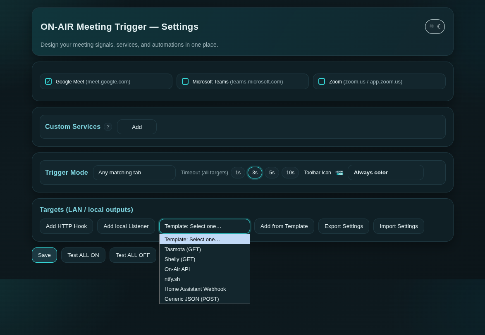

# ON-AIR Meeting Trigger


Detect Google Meet, Microsoft Teams, and Zoom meetings and trigger
local or LAN automations (Home Assistant, Tasmota, LED signs).


## Quick start
- Chromium / Chrome extension [now published at CWS](https://chromewebstore.google.com/detail/dhcgpjlbnchcbnpplfidkfbfmapokhfn?utm_source=item-share-cb)
- LAN-first, no cloud required e.g. [OnAir Led/Neon sign](https://github.com/mveplus/onair-led-sign-firmware) 
- Works great with Home Assistant
- Works without Smart Home hardware [Phone push notifications](docs/ON-AIR-Push-Notifications.md)

👉 **Full documentation:**  [extension/README.md](extension/README.md)
  
👉 **Templates guide:**  [docs/TEMPLATES.md](docs/TEMPLATES.md)

## Features
- Meeting detection (Meet / Teams / Zoom)
- Custom service detection (user-defined URL prefixes)
- HTTP hooks (Home Assistant, Tasmota, Shelly, ESP)
- **IoT (local + cloud)** target type — tries the device's local HTTP API first and transparently falls back to **your own** AWS IoT MQTT publish (via your own API Gateway + Lambda) when off-LAN. Bring-your-own-cloud, no third-party in the loop.
- Toolbar popup with at-a-glance ON-AIR status and one-click **Pause** (1 hour / until you resume)
- Redesigned settings UI with an unsaved-changes save bar
- Built-in templates for common targets, including OnAir Cloud Bridge (AWS IoT Lambda) — pick solid or breathing from the ON-mode dropdown — plus a local-first-hybrid variant
- Import/export settings (includes trigger mode, timeout, toolbar icon mode) — credentials are excluded from exports
- Flatpak / Snap compatible
- Privacy-first (no telemetry; tokens are stored in `chrome.storage.local` and never synced to your Google account; only the meeting site origin is shared by default — the full meeting URL/ID is sent only when you opt in)



## Releasing 

Releases are automated via GitHub Actions.

To publish a new version:
```bash
./scripts/release.sh X.Y.Z
```

This will:
- update extension/manifest.json and VERSION
- commit the change
- create a git tag (vX.Y.Z)
- push to GitHub
- trigger an automated GitHub Release with a ZIP artifact


## License

This project is licensed under the [MIT License](LICENSE).
