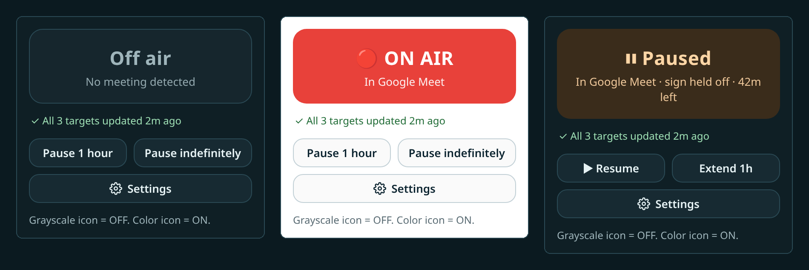
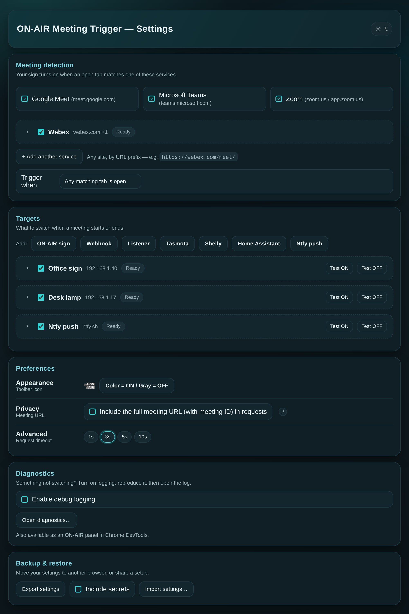

# ON-AIR Meeting Trigger


Detect Google Meet, Microsoft Teams, and Zoom meetings and trigger
local or LAN automations (ON-AIR sign, Home Assistant, Tasmota, Shelly, phone push).


## Quick start
- Chromium / Chrome extension [now published at CWS](https://chromewebstore.google.com/detail/dhcgpjlbnchcbnpplfidkfbfmapokhfn?utm_source=item-share-cb)
- LAN-first, no cloud required e.g. [OnAir Led/Neon sign](https://github.com/mveplus/onair-led-sign-firmware) 
- Works great with Home Assistant
- Works without Smart Home hardware — [phone push notifications via Ntfy](docs/ON-AIR-Push-Notifications.md)

👉 **Full documentation:**  [extension/README.md](extension/README.md)
  
👉 **Templates guide:**  [docs/TEMPLATES.md](docs/TEMPLATES.md)

## Features
- Meeting detection (Meet / Teams / Zoom)
- Custom service detection (user-defined URL prefixes)
- Webhooks for anything with an HTTP API, with one-click templates for Tasmota, Shelly, Home Assistant and Ntfy push
- **Phone push notifications** via [Ntfy](https://ntfy.sh) or any webhook — get pinged when a meeting starts/ends, no smart-home hardware required
- **ON-AIR sign** target (local + cloud, solid or breathing) — tries the sign's local HTTP API first and transparently falls back to **your own** AWS IoT MQTT publish (via your own API Gateway + Lambda) when off-LAN. Bring-your-own-cloud, no third-party in the loop.
- **Per-target reconcile modes** (fire-once / verify / re-assert) — keeps your sign in sync and self-heals a missed command, without duplicate notifications
- Toolbar popup with at-a-glance ON-AIR status, a "did it work?" health line and one-click **Pause** (1 hour / until you resume)
- Settings that stay out of the way: collapsible cards, instant save for preferences, a save bar for target edits, per-target Test buttons with inline results
- Import/export settings (includes trigger mode, timeout, toolbar icon mode) — credentials are excluded from exports
- Flatpak / Snap compatible
- Privacy-first (no telemetry; tokens are stored in `chrome.storage.local` and never synced to your Google account; only the meeting site origin is shared by default — the full meeting URL/ID is sent only when you opt in)





## Releasing 

Releases are automated via GitHub Actions.

Note changes under **Unreleased** in [CHANGELOG.md](CHANGELOG.md) as they
land. To publish a new version:
```bash
./scripts/release.sh --dry-run X.Y.Z   # optional: checks only
./scripts/release.sh X.Y.Z
```

This will:
- move the Unreleased notes in CHANGELOG.md under the new version
- update extension/manifest.json and VERSION
- commit the change
- create a git tag (vX.Y.Z)
- push to GitHub
- trigger an automated GitHub Release with a ZIP artifact
- upload that ZIP to the Chrome Web Store as a **draft** — submit it for
  review by hand in the developer console. If the previous version is still
  in review, the upload is skipped with a warning; run
  **Actions → Upload to Chrome Web Store** once it's through

Store screenshots: `scripts/make-store-shots.sh` (see
[docs/STORE_LISTING.md](docs/STORE_LISTING.md)).


## Credits

Built with the help of AI coding assistants — [OpenAI Codex](https://openai.com/index/introducing-codex/) and [Claude Code](https://claude.com/claude-code).

## License

This project is licensed under the [MIT License](LICENSE).
