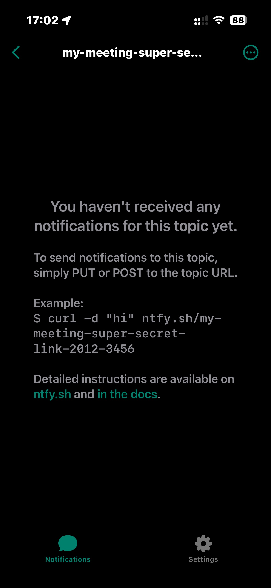
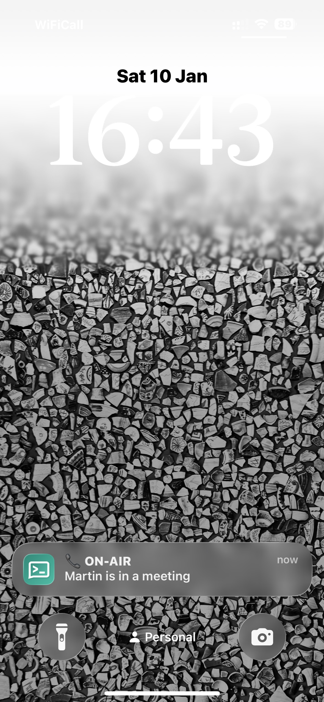
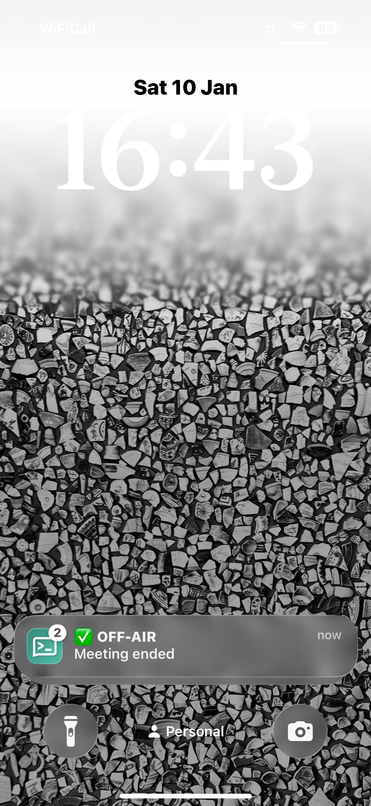

# ON-AIR Push Notifications – Delivery Options

This document describes **three supported ways** to deliver ON-AIR / OFF-AIR push notifications from the **ON-AIR Chrome Extension** (or any HTTP-capable tool such as `curl`) to family members’ devices.

All options use **simple HTTP calls**: in the extension each one is a
**Webhook** target (Settings → Targets). For ntfy there's a one-click
**Ntfy push** button that pre-fills both URLs — just replace `YOUR_TOPIC`.

Leave the target's **Keep the sign in sync** on *Fire once* (the default for
webhooks) so a meeting sends exactly one notification.

---

## Option A — ntfy (fast, free, simple)


### Topic use a hard to guess phrase [ do not use this example ]:
```
my-meeting-super-secret-link-2012-3456
```


### ON-AIR (curl)
```bash
curl -H "Priority: 5" \
     -H "Title: 📞 ON-AIR" \
     -d "I'm in a meeting" \
     https://ntfy.sh/my-meeting-super-secret-link-2012-3456
```

### ON-AIR (Chrome extension – GET)
```
https://ntfy.sh/my-meeting-super-secret-link-2012-3456/publish?title=%F0%9F%93%9E%20ON-AIR&message=I%27m%20in%20a%20meeting&priority=urgent
```



### OFF-AIR (curl)
```bash
curl -H "Priority: 2" \
     -H "Title: ✅ OFF-AIR" \
     -d "Meeting ended" \
     https://ntfy.sh/my-meeting-super-secret-link-2012-3456
```

### OFF-AIR (Chrome extension – GET)
```
https://ntfy.sh/my-meeting-super-secret-link-2012-3456/publish?title=%E2%9C%85%20OFF-AIR&message=Meeting%20ended&priority=low
```



---

## Option B — Pushover (paid, very reliable)

### Required
- APP_TOKEN
- USER_KEY (or group key)

⚠️ Pushover **requires HTTP POST** with `application/x-www-form-urlencoded` data. It **cannot be triggered using GET-only hooks**.

### ON-AIR (curl)
```bash
curl -s \
  --form-string "token=APP_TOKEN" \
  --form-string "user=USER_KEY" \
  --form-string "priority=1" \
  --form-string "title=📞 ON-AIR" \
  --form-string "message=I'm in a meeting" \
  https://api.pushover.net/1/messages.json
```
#### ON-AIR (Chrome extension – POST)

**URL**
```
https://api.pushover.net/1/messages.json
```

**Method**
```
POST
```

**Headers**
```
Content-Type: application/x-www-form-urlencoded
```

**Body** (one line)
```
token=APP_TOKEN&user=USER_KEY&priority=1&title=%F0%9F%93%9E%20ON-AIR&message=I%27m%20in%20a%20meeting
```

### OFF-AIR (curl)
```bash
curl -s \
  --form-string "token=APP_TOKEN" \
  --form-string "user=USER_KEY" \
  --form-string "priority=0" \
  --form-string "title=✅ OFF-AIR" \
  --form-string "message=Meeting ended" \
  https://api.pushover.net/1/messages.json
```
#### OFF-AIR (Chrome extension – POST)

**URL**
```
https://api.pushover.net/1/messages.json
```

**Method**
```
POST
```

**Headers**
```
Content-Type: application/x-www-form-urlencoded
```

**Body** (one line)
```
token=APP_TOKEN&user=USER_KEY&priority=0&title=%E2%9C%85%20OFF-AIR&message=Meeting%20ended
```

---

## Option C — Telegram Bot (free, familiar)
Telegram delivers messages to a family group chat using a bot and a single HTTP POST endpoint.

### Required
- BOT_TOKEN
- CHAT_ID (family group recommended)

### ON-AIR (curl)
```bash
curl -s -X POST "https://api.telegram.org/botBOT_TOKEN/sendMessage" \
  -d "chat_id=CHAT_ID" \
  --data-urlencode "text=📞 ON-AIR — I'm in a meeting"
```

### ON-AIR (Chrome Extension — HTTP POST)

**URL**
```
https://api.telegram.org/botBOT_TOKEN/sendMessage
```

**Method**
```
POST
```

**Headers**
```
Content-Type: application/x-www-form-urlencoded
```

**Body** (one line)
```
chat_id=CHAT_ID&text=%F0%9F%93%9E%20ON-AIR%20%E2%80%94%20I%27m%20in%20a%20meeting
```

### OFF-AIR (curl)
```bash
curl -s -X POST "https://api.telegram.org/botBOT_TOKEN/sendMessage" \
  -d "chat_id=CHAT_ID" \
  --data-urlencode "text=✅ OFF-AIR — Meeting ended"
```

### OFF-AIR (Chrome Extension — HTTP POST)

Same URL, method and header as ON-AIR, with this body:

```
chat_id=CHAT_ID&text=%E2%9C%85%20OFF-AIR%20%E2%80%94%20Meeting%20ended
```

---

## Summary

| Option | Cost | Ease | Apple-friendly | Notes |
|------|------|------|----------------|------|
| ntfy | Free | ⭐⭐⭐⭐⭐ | ⭐⭐⭐⭐⭐ | Best default |
| Pushover | Low | ⭐⭐⭐⭐ | ⭐⭐⭐⭐⭐ | POST only |
| Telegram | Free | ⭐⭐⭐ | ⭐⭐⭐⭐ | Chat-based |

---

## Design principle

The ON-AIR extension performs **HTTP calls only**.  
Notification providers are **replaceable components**, ensuring long-term flexibility.
