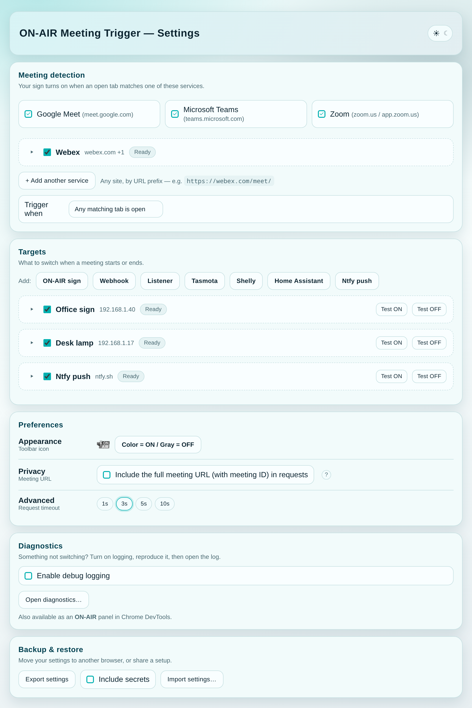

# ON-AIR Meeting Trigger (Chromium Extension)

Detects when a **Google Meet**, **Microsoft Teams**, **Zoom** or **custom**
meeting tab is open (or active) and switches your outputs — an ON-AIR sign, a
smart plug, Home Assistant, a phone notification, or any HTTP endpoint.

---

## How it works

- A tab matching one of your meeting services turns the state **ON**; when
  none is left it goes **OFF**.
- **Trigger when** decides what counts: *Any matching tab is open* (works even
  before you join) or *Only the active tab matches*.
- On every ON↔OFF change, every enabled **target** fires once. A 1-minute
  heartbeat keeps devices in sync afterwards (see
  [Keep the sign in sync](#keep-the-sign-in-sync)).

---

## Toolbar popup


- A colour-coded card: **🔴 ON AIR**, **Off air** or **⏸ Paused**, with the
  meeting it sees ("In Google Meet").
- A health line answering "did it work?" — e.g. *✓ All 3 targets updated 2m
  ago*, or which target failed and why, with a link to the diagnostics log.
- **Pause 1 hour** / **Pause indefinitely** — holds the sign OFF without
  touching settings. While paused: **Resume** or **Extend 1h**.
- **Settings** opens the settings page.

---

## Settings



Settings are grouped top to bottom:

1. **Meeting detection** — Meet / Teams / Zoom, your custom services and
   *Trigger when*. Saved instantly.
2. **Targets** — what to switch. Target edits are saved with the **Save now**
   bar that appears when something changed (it also names any site Chrome will
   ask you to allow).
3. **Preferences** — toolbar icon (always colour, or colour = ON / grey = OFF),
   privacy (full meeting URL on/off) and the request timeout. Saved instantly.
4. **Diagnostics** — optional activity log.
5. **Backup & restore** — export / import.

Every card collapses to a one-line summary (name · host · status) — click it
to edit. **Remove** is undoable for a few seconds.

---

## Custom services

Add any meeting site by name and URL prefix (one per line):

```
Name: Webex
Meeting URLs:
https://web.webex.com/meet/
https://company.webex.com/meet/
```

A tab whose address starts with one of these counts as a meeting, and
`{service}` is sent as `Webex`. A prefix typed without `https://` gets it added
automatically. A service without a name or URL is flagged on its card and
isn't saved until it's complete.

---

## Targets

Add targets from the row of buttons in **Targets**:

| Button | What you get |
|---|---|
| **ON-AIR sign** | The companion [ON-AIR sign](https://github.com/mveplus/onair-led-sign-firmware) — local first, AWS IoT cloud fallback |
| **Webhook** | Any HTTP endpoint — ON/OFF URL, method, headers, body, Basic Auth |
| **Listener** | A local app that receives the state on one URL |
| **Tasmota** · **Shelly** · **Home Assistant** · **Ntfy push** | A Webhook pre-filled for that device or service |

Pre-filled templates mark what you must fill in as `YOUR_…` (e.g.
`YOUR_DEVICE_IP`); the card shows **⚠ Replace YOUR_…** until you do. Details
for each: [Templates guide](../docs/TEMPLATES.md).

Every target has **Test ON / Test OFF** buttons that run the exact request
the extension sends in a real meeting, and show the result inline.

### ON-AIR sign (local + cloud)

One target that tries the sign's local HTTP API first (~30 ms on your Wi-Fi)
and falls back to **your own** AWS IoT cloud bridge when the sign isn't
reachable — exactly one command per meeting event either way.

- **Local**: base URL + `X-API-Token`. Leave blank for cloud-only.
- **Cloud**: API Gateway endpoint + bearer token + AWS IoT thing name. Leave
  blank for LAN-only.
- **ON mode** solid or breathing; **OFF mode** off.
- **Local timeout** before falling back (default 1500 ms).

The cloud bridge (API Gateway + Lambda) is deployed from the firmware repo's
[`scripts/cloud-bridge/`](https://github.com/mveplus/onair-led-sign-firmware/tree/main/scripts/cloud-bridge);
its `deploy.sh` prints the endpoint and token to paste here.

### Webhook

- ON URL / OFF URL (either may be blank), method `GET` / `POST` / `PUT`.
- Optional headers (`Key: Value`, one per line), body, Basic Auth.
- Optional response checks: allowed status codes and "body contains" text.
- A body that starts with `{` or `[` is sent as `application/json` unless you
  set your own `Content-Type`.

### Listener

One URL called on every change. With tokens:

```
http://127.0.0.1:8765/event?state={state}&service={service}&url={url}&ts={ts}
```

Without tokens, `?state=…&service=…&url=…&ts=…` is appended for you.

### Tokens

Usable in URLs and bodies:

- `{state}` → `ON` / `OFF`
- `{service}` → `meet`, `teams`, `zoom`, your custom service name, or `test`
  from a Test button
- `{url}` → the meeting **site only** (e.g. `https://meet.google.com`) unless
  you turn on *Include the full meeting URL* in Preferences
- `{ts}` → Unix time in ms
- `{url_raw}` → `{url}` without escaping

Values are escaped for where they land (URL-encoded in URLs, JSON-escaped in
JSON bodies), so a crafted meeting link can't inject parameters.

### Keep the sign in sync

Each target chooses what the 1-minute heartbeat does (**Keep the sign in
sync** on the card):

- **Fire once when the meeting starts/ends** — never on the heartbeat. The
  only choice for notifications, so you never get duplicate pushes.
- **Verify actual state & fix only if it drifted** — ON-AIR sign only: reads
  the sign's state (on the LAN, or via the cloud bridge when away) and
  re-sends only if it's wrong.
- **Re-assert the state on every 1-min check** — blindly re-sends; fine for
  idempotent devices such as plugs.

Defaults: ON-AIR sign → verify; everything else → fire once.

---

## Diagnostics

MV3 suspends the service worker, so live console logs are unreliable. Turn
on **Enable debug logging** (Settings → Diagnostics) to keep a rolling log of
state changes, heartbeat checks and worker restarts, with per-target outcome,
HTTP status, latency and error text.

Open it via **Open diagnostics…** or the **ON-AIR** panel in Chrome DevTools.
**Copy report** bundles the log with your redacted settings for a bug report.

---

## Backup & restore

**Export settings** saves targets, custom services and preferences to
`onair-settings.json`. Tokens and passwords are left out unless you tick
**Include secrets** (separately confirmed; the file is then named
`onair-settings-with-secrets.json`). **Import settings…** shows which hosts
the imported targets talk to before adding them.

---

## Privacy & credentials

- No telemetry. Requests go only to the endpoints you configure.
- Tokens, passwords and secret-looking headers/URLs (e.g. webhook URLs) live
  in `chrome.storage.local` and never sync to your Google account.
- `{url}` sends only the meeting site by default — never the meeting ID unless
  you opt in.
- A token sent over plain `http://` to a non-LAN host shows a warning.

Full policy: [PRIVACY.md](../docs/PRIVACY.md).

---

## Permissions

`storage`, `tabs`, `alarms` (the 1-minute heartbeat). Access to your
endpoints' hosts (e.g. `http://192.168.1.17/*`) is requested only when you
save a target that uses them, and released when no target needs it anymore.

---

## Installation

From the [Chrome Web Store](https://chromewebstore.google.com/detail/dhcgpjlbnchcbnpplfidkfbfmapokhfn?utm_source=item-share-cb),
or unpacked:

1. Open `chrome://extensions` and enable **Developer mode**.
2. **Load unpacked** → select this `extension/` folder.

### Ungoogled Chromium (Flatpak)

Sandboxed builds need the unpacked folder inside the sandbox, e.g.
`~/.var/app/io.github.ungoogled_software.ungoogled_chromium/data/extensions/onair/`
— otherwise the popup can fail with `ERR_FILE_NOT_FOUND`. Snap Chromium works
with the Chrome Web Store build.

---

## Troubleshooting

- **`*.local` hosts don't resolve** from the extension on Linux — give the
  device a fixed IP (DHCP reservation) instead. See the
  [Templates guide](../docs/TEMPLATES.md#heads-up-local-mdns-in-mv3-service-workers).
- **Self-signed HTTPS** endpoints fail unless the browser trusts the cert.
- One unreachable target never blocks the others; the popup's health line and
  the diagnostics log tell you which one failed.

---

## Development

```bash
npm test                  # unit tests for shared.js (Node's built-in runner)
scripts/build-zip.sh      # dist.zip of this folder
```

Releases: see the [repository README](../README.md#releasing). Version history:
[GitHub Releases](https://github.com/mveplus/onair-meeting-trigger/releases).

## More

- [Templates guide](../docs/TEMPLATES.md)
- [Push notifications](../docs/ON-AIR-Push-Notifications.md)
- [Privacy Policy](../docs/PRIVACY.md) · [Terms of Service](../docs/TERMS_OF_SERVICE.md)
- [MIT License](../LICENSE)
